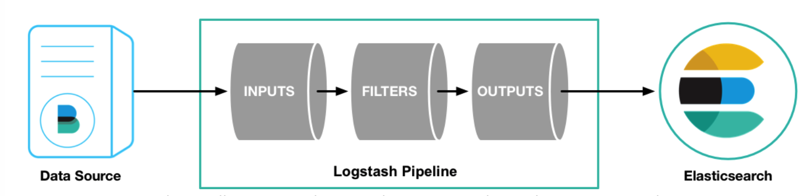

## Logstash笔记

A Logstash pipeline has two required elements, input and output, and one optional element, filter

一个Logstash pipeline至少需要两个必须的元素：input 和 output及一个可选的元素filter

input插件从数据源中消费数据
filter插件根据你自定义的需求修改数据
output插件将处理完的数据写到目的地

### logstash工作流程

