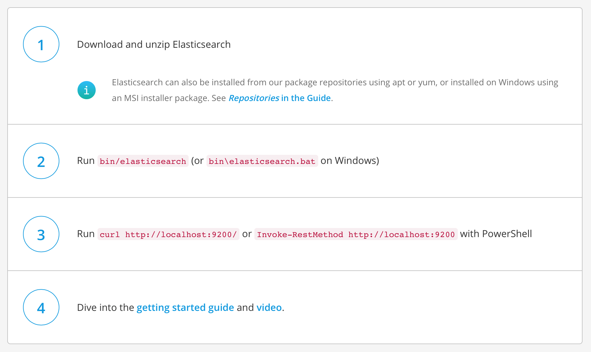
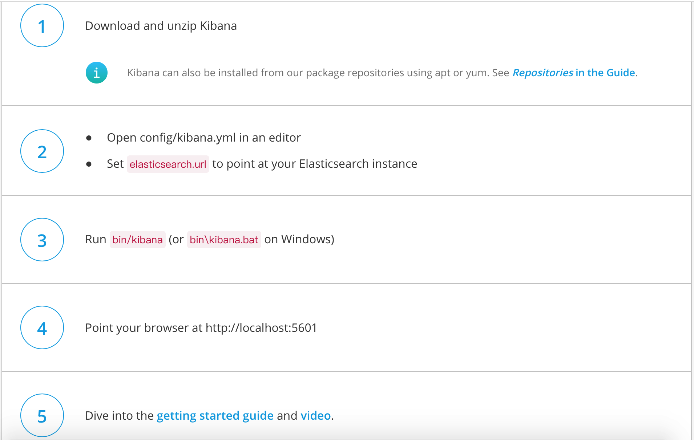
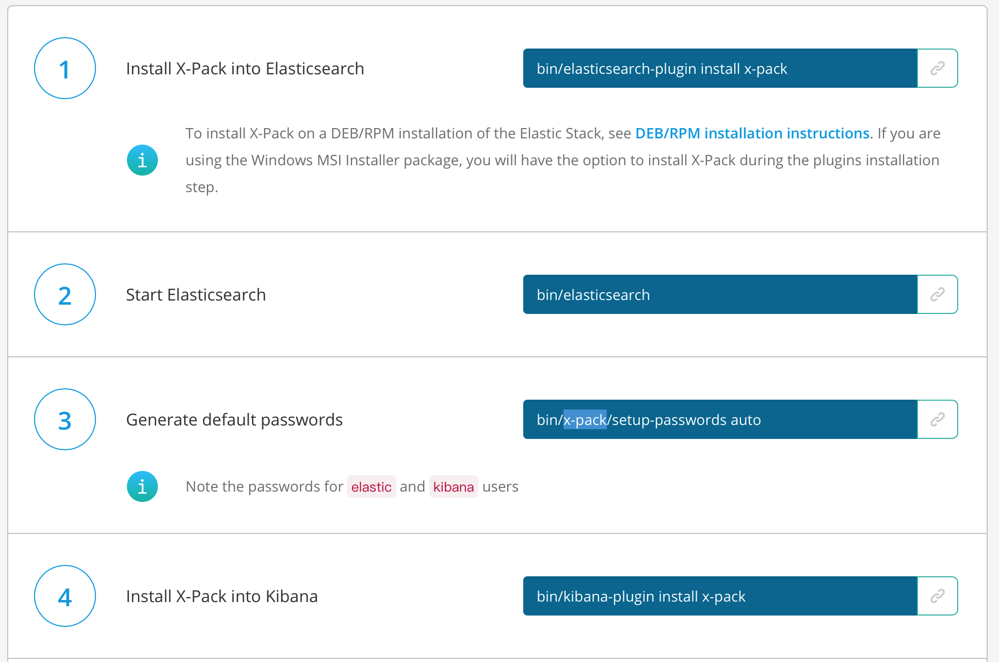
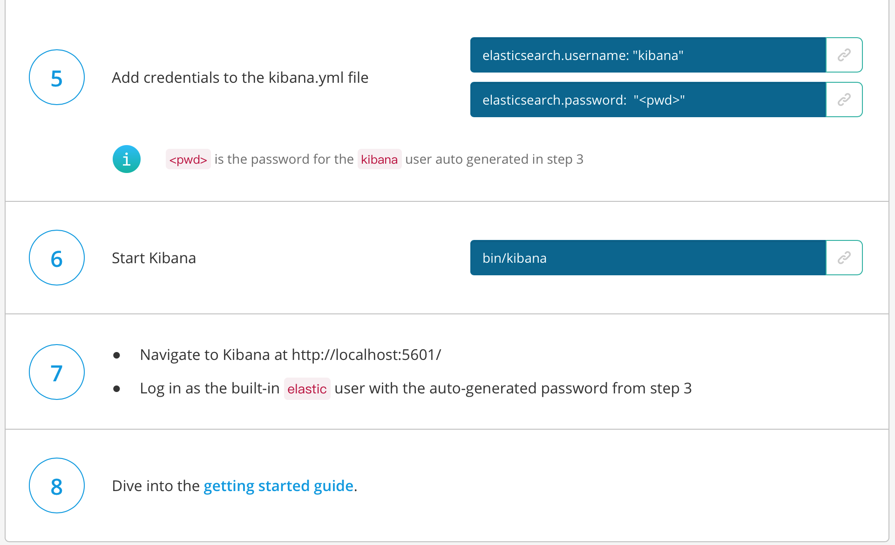

## ELK 日志分析平台

### E 数据中心及搜索引擎
Elasticsearch 是一个分布式的 RESTful 风格的搜索和数据分析引擎，能够解决不断涌现出的各种用例。
作为 Elastic Stack 的核心，它集中存储您的数据，帮助您发现意料之中以及意料之外的情况。

### L 数据采集

集中、转换和存储数据
Logstash 是开源的服务器端数据处理管道，能够同时 从多个来源采集数据、转换数据，然后将数据发送到您最喜欢的 “存储库” 中。（我们的存储库当然是 Elasticsearch。）

### K 可视化页面

Kibana 让您能够可视化 Elasticsearch 中的数据并操作 Elastic Stack，

### X-Pack 扩展功能
X-Pack 将诸多强大功能集合到一个单独的程序包中，更将它带上了一个新的层次。

如：Security，Alerting，Monitoring，Reporting，Graph，Machine Learning

### Elasticsearch 安装

官方网站
> https://www.elastic.co

下载地址
> https://www.elastic.co/downloads/elasticsearch

解压
> unzip elasticsearch-6.0.0.zip

进入根目录
> cd elasticsearch-6.0.0

启动elasticsearch（可以配置到环境变量中去）
> bin/elasticsearch

测试启动是否成功
> curl http://localhost:9200/

### Kibana 安装
下载地址
> https://www.elastic.co/cn/downloads/kibana

1.下载并解压

2.在文件config/kibana.yml 中配置elasticsearch.url
> elasticsearch.url: "http://localhost:9200"

3.启动服务
> bin/kibana

4.访问kibana
> http://localhost:5601

### X-Pack安装

1.安装X-Pack到Elasticsearch
> bin/elasticsearch-plugin install x-pack

2.启动elasticsearch
> bin/elasticsearch

3.生成默认密码
> bin/x-pack/setup-passwords auto

> 注意这个密码适用于 elastic 和 kibana 的用户

4.安装X-Pack到kibana
> bin/kibana-plugin install x-pack

5.将之前生成的用户名密码加到kibana.yml文件中
> elasticsearch.username: "kibana"

> elasticsearch.password:  "auto"

> 注意：密码是第三步生成的

6.启动kibana
> bin/kibana

7.登录
> http://localhost:5601/   

> 用户名:elastic 密码：auto

### 附录A - Elasticsearch 安装

### 附录B - Logstash 安装

### 附录C - Kibana 安装

### 附录D - X-Pack 安装

